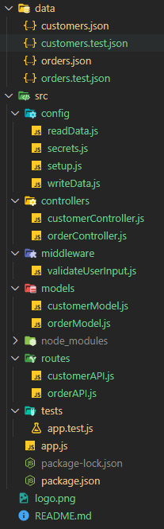

## ✔️ Sogeti Assignment (Node.js/Express.js)

---

<br>
<br>




The image on the right 👉 show my project layout. The data folder was provided in the sample project and I am using that as a mock database folder. test.json files are used as database storages when running tests and the other ones are development databases.

The src folder contains all the backend logic.

- The config folder contains readData.js and writeData.js files which are used to read and write data to the JSON files in the data folder. The secret.js file contains the path to the databases and the port of the server. Lastly, the setup.js file is used to switch between databases when running in development or test modes
- The controller folder contains the logic for each API route.
- The middleware folder contains the validateUserInput.js middleware that is used to validate user input
- The models folder contains user and customer models
- The nodemodules folder stores all the dependencies
- The routes folder has the api endpoints to which the client will be speaking to
- The tests folder contains the test file that can be run by the following command:
  -  `PS C:\...\Node.JS\src> npm test`
- Next, we have the app.js which can be run by the following command: 
  - `PS C:\...\Node.JS\src> nodemon app.js`. I am using nodemon package because it can detect changes.
- Lastly, we have the package.json, package-lock.json, two images bring used in the readme and the readme file itself.

<br>
<br>

In case if you're interested in testing the API endpoints yourself, here are the example JSON body data that you can use:
<br>
<br>

```
🔨 POST request ('/api/customer/add_customer)
{
    "customer": {
        "firstName": 3533,
        "lastName": "abc",
        "age": 333,
        "address": "USA",
        "phoneNumber": 3423235
    }
}


↪️ GET request (/api/order/get_by_customer)
{
    "order":{
        "customerID": "dbaa923f-ab62-46df-b28c-6adc80f10bff"
    }
}


↪️ GET request (/api/order/get_all)
//No Body


🔨 POST request (/api/order/create_order)
{
    "order": {
       "customerID": "dbaa923f-ab62-46df-b28c-6adc80f10bff",
       "type": "groceries",
       "items": ["apple", "bread", "chicken"],
       "total_items": 3,
       "cost": "$35.00"
    }
}

🩹 PUT request (/api/order/update_order)
{
    "order": {
       "customerID": "dff333df-43d1-462f-b476-dabf01c3e724",
       "type": "aqdd",
       "items": ["pants", "racket", "iphone"],
       "total_items": 3,
       "cost": "$1444.00",
       "orderID": "0759a8f9-3e0e-48db-83b4-61e40d2a7f6e"
    }
}

❌ DELETE request (/api/order/delete_order)
{
    "order": {
       "orderID": "3929e0fa-feae-40de-a5bd-35237373ca0c"
    }
}

```

<br>
<br>

I would love to hear your feedback. Please reach out to me at 📧 amir.col6@gmail.com to share your thoughts. I hope you liked my attempt ✌️
